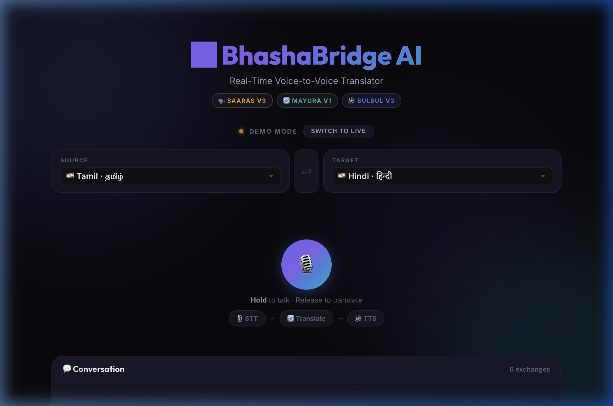
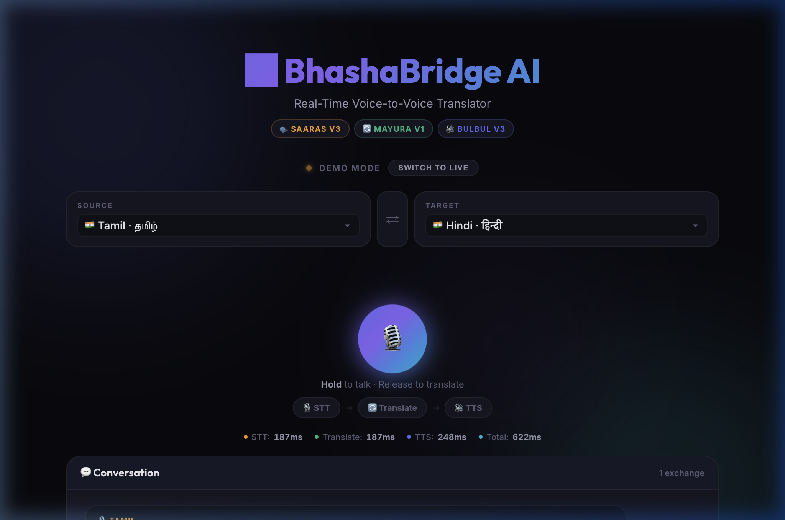
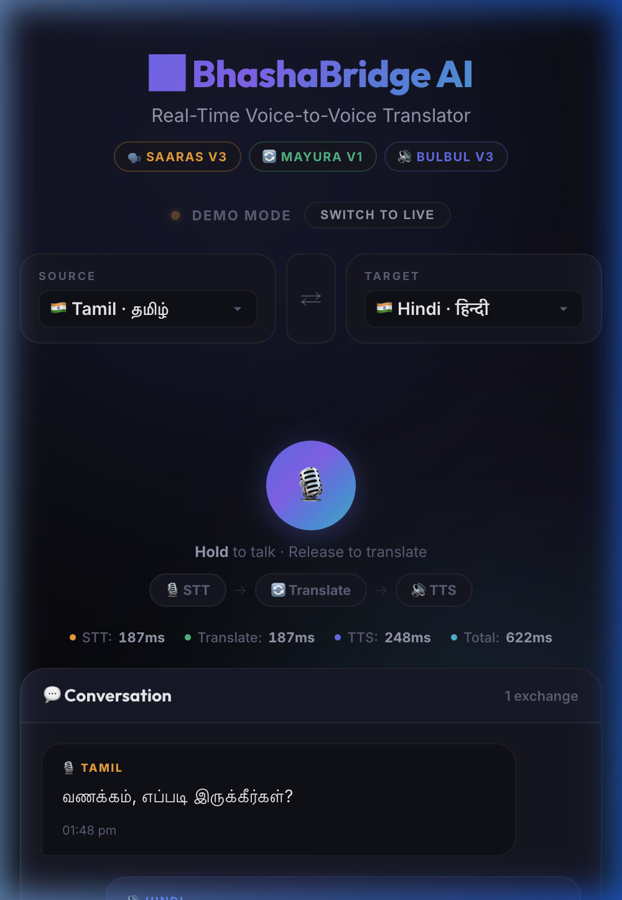

<p align="center">
  <h1 align="center">🌉 BhashaBridge AI</h1>
  <p align="center">
    <strong>Real-Time Streaming Voice-to-Voice Translator for Indian Languages</strong>
  </p>
  <p align="center">
    Powered by <a href="https://www.sarvam.ai/">Sarvam AI</a> · FastAPI · WebSockets
  </p>
  <p align="center">
    
    
    
    
    
  </p>
</p>

---

## 🎯 What is BhashaBridge AI?

**BhashaBridge AI** is a production-ready, real-time voice-to-voice translation system built *exclusively* on the **Sarvam AI** stack. It translates spoken Indian languages into other Indian languages **as the person speaks** — not after they finish.

Unlike generic translation tools built on Western LLMs, BhashaBridge uses Sarvam's **Indic-native models** that are mathematically optimized for Indian scripts:

| Metric | Western Tokenizer (GPT-3.5) | Sarvam Indic Tokenizer |
|--------|------------------------------|------------------------|
| 1 Tamil word | 3-4 tokens | ~1 token |
| 1 Hindi sentence (10 words) | ~30 tokens | ~12 tokens |
| API cost per conversation | High | **4x lower** |
| Latency per request | Higher | **Significantly lower** |

---

## � Demo Walkthrough

BhashaBridge AI ships with a **self-contained demo** (`demo.html`) — no backend or API key required. Just open it in a browser to experience the full translation flow.

### Desktop — Home Screen

<p align="center">
  
</p>

> Select source and target languages, then **hold the mic button** (or press **Spacebar**) to start a translation.

### Desktop — Live Translation (Tamil → Hindi)

<p align="center">
  
</p>

> The pipeline processes **STT → Translate → TTS** in ~622ms total. Latency metrics are displayed in real time. The translated text is spoken aloud using the browser's SpeechSynthesis API.

### Mobile — Responsive View

<p align="center">
  
</p>

> Fully responsive layout adapts to any screen size — phones, tablets, and desktops.

### Try It Yourself

```bash
# Just open in browser — no server needed:
open demo.html

# Or serve locally:
python -m http.server 3000
# Visit http://localhost:3000/demo.html
```

**Demo features:** Hold-to-talk with waveform animation · Pipeline step visualization · Realistic latency metrics · Auto-plays translated audio · 7+ language pairs with code-switching · Demo/Live mode toggle · Spacebar shortcut

---

## �🏗️ Architecture

```
┌─────────────────────────────────────────────────────────────────┐
│                        CLIENT (Browser)                         │
│  ┌──────────┐    ┌─────────────────┐    ┌───────────────────┐  │
│  │ 🎙️ Mic   │───▶│ Web Audio API   │───▶│ WebSocket Client  │  │
│  │ Capture  │    │ 16kHz Mono PCM  │    │ Binary Streaming  │  │
│  └──────────┘    └─────────────────┘    └────────┬──────────┘  │
│                                                   │             │
│  ┌──────────┐    ┌─────────────────┐              │             │
│  │ 🔊 Audio │◀───│ Audio Playback  │◀─── JSON ◀──┘             │
│  │ Speaker  │    │ (Translated)    │   (audio_base64)           │
│  └──────────┘    └─────────────────┘                            │
└─────────────────────────────────────────────────────────────────┘
                            │ WebSocket │
                            ▼           ▲
┌─────────────────────────────────────────────────────────────────┐
│                    SERVER (FastAPI + Uvicorn)                    │
│                                                                 │
│  ┌─────────────────────────────────────────────────────────────┐│
│  │                   WebSocket Handler                         ││
│  │  • Receives binary audio chunks (500ms segments)            ││
│  │  • Manages session state & language config                  ││
│  │  • Sends progressive JSON results                           ││
│  └────────────────────────┬────────────────────────────────────┘│
│                           │                                     │
│  ┌────────────────────────▼────────────────────────────────────┐│
│  │              Voice-to-Voice Pipeline (async)                ││
│  │                                                             ││
│  │  ┌──────────────┐  ┌───────────────┐  ┌──────────────────┐ ││
│  │  │ 🗣️ Saaras v3 │─▶│ 🔄 Mayura v1  │─▶│ 🔊 Bulbul v3    │ ││
│  │  │ Speech→Text │  │ Text→Text    │  │ Text→Speech      │ ││
│  │  │ (STT)       │  │ (Translate)  │  │ (TTS)            │ ││
│  │  └──────────────┘  └───────────────┘  └──────────────────┘ ││
│  └─────────────────────────────────────────────────────────────┘│
└─────────────────────────────────────────────────────────────────┘
                            │
                            ▼
              ┌─────────────────────────┐
              │     Sarvam AI Cloud     │
              │   api.sarvam.ai         │
              └─────────────────────────┘
```

### Pipeline Flow

```
Audio In ──500ms──▶ Saaras v3 (STT) ──text──▶ Mayura v1 (Translate) ──text──▶ Bulbul v3 (TTS) ──audio──▶ Audio Out
  chunks              ~200ms                      ~150ms                          ~300ms

Total latency per chunk: ~650ms (sub-second real-time translation)
```

---

## 🗣️ Supported Languages

| Language | Code | Native Script | STT | Translate | TTS |
|----------|------|---------------|-----|-----------|-----|
| Hindi | `hi-IN` | हिन्दी | ✅ | ✅ | ✅ |
| Tamil | `ta-IN` | தமிழ் | ✅ | ✅ | ✅ |
| Telugu | `te-IN` | తెలుగు | ✅ | ✅ | ✅ |
| Kannada | `kn-IN` | ಕನ್ನಡ | ✅ | ✅ | ✅ |
| Malayalam | `ml-IN` | മലയാളം | ✅ | ✅ | ✅ |
| Bengali | `bn-IN` | বাংলা | ✅ | ✅ | ✅ |
| Gujarati | `gu-IN` | ગુજરાતી | ✅ | ✅ | ✅ |
| Marathi | `mr-IN` | मराठी | ✅ | ✅ | ✅ |
| Punjabi | `pa-IN` | ਪੰਜਾਬੀ | ✅ | ✅ | ✅ |
| Odia | `or-IN` | ଓଡ଼ିଆ | ✅ | ✅ | ✅ |
| English | `en-IN` | English | ✅ | ✅ | ✅ |

> **Code-Switching Support**: Saaras v3 handles mixed-language input (e.g., Tamil + English) natively via its `codemix` mode.

---

## 📁 Project Structure

```
Bashabridge/
├── backend/                    # Python server
│   ├── main.py                 # FastAPI — WebSocket + REST + serves frontend
│   ├── config.py               # Configuration & language definitions
│   ├── requirements.txt        # Python dependencies
│   ├── .env                    # API keys (git-ignored)
│   └── .env.example            # Environment variable template
├── frontend/                   # Browser client
│   ├── index.html              # Interactive demo UI (works standalone too)
│   └── app.js                  # Audio streaming client (vanilla JS)
├── assets/                     # Documentation media
│   ├── demo-desktop-home.png
│   ├── demo-desktop-conversation.png
│   └── demo-mobile.png
├── Dockerfile                  # Production container
├── .gitignore
└── README.md
```

---

## 🚀 Quick Start

### Prerequisites

- **Python 3.11+**
- **Sarvam AI API Key** — [Get one free at dashboard.sarvam.ai](https://dashboard.sarvam.ai)

### 1. Clone & Setup

```bash
git clone https://github.com/YOUR_USERNAME/Bashabridge.git
cd Bashabridge

# Create virtual environment
python -m venv venv
source venv/bin/activate  # macOS/Linux
# venv\Scripts\activate   # Windows

# Install dependencies
pip install -r requirements.txt
```

### 2. Configure API Key

```bash
cp .env.example .env
# Edit .env and add your Sarvam AI API key
```

```env
SARVAM_API_KEY=your_actual_api_key_here
```

### 3. Run the Server

```bash
python main.py
```

The server starts at `http://localhost:8000`. Visit the root URL to see the API landing page.

### 4. Test the API

```bash
# Health check
curl http://localhost:8000/health

# List supported languages
curl http://localhost:8000/languages

# Text translation (Tamil → Hindi)
curl -X POST http://localhost:8000/translate/text \
  -H "Content-Type: application/json" \
  -d '{"text": "வணக்கம், எப்படி இருக்கீர்கள்?", "source_lang": "ta-IN", "target_lang": "hi-IN"}'
```

---

## 🔌 API Reference

### REST Endpoints

| Method | Endpoint | Description |
|--------|----------|-------------|
| `GET` | `/` | Landing page |
| `GET` | `/health` | Health check (includes Sarvam API status) |
| `GET` | `/languages` | List all supported languages |
| `POST` | `/translate/text` | Text-only translation |
| `POST` | `/synthesize` | Text-to-Speech generation |

### WebSocket Endpoint

```
WS /ws/translate?source_lang=auto&target_lang=hi-IN&speaker=meera
```

#### Client → Server Messages

| Type | Format | Description |
|------|--------|-------------|
| Audio | Binary (bytes) | Raw PCM audio: 16kHz, 16-bit, mono |
| Config | `{"type": "config", "source_lang": "ta-IN", "target_lang": "hi-IN"}` | Update language pair mid-session |
| End | `{"type": "end"}` | Signal end-of-utterance (flush buffer) |
| Ping | `{"type": "ping"}` | Keepalive heartbeat |

#### Server → Client Messages

| Type | Payload | Description |
|------|---------|-------------|
| `transcript` | `{"text": "...", "lang": "ta-IN"}` | Real-time transcription |
| `translation` | `{"original": "...", "translated": "...", "source_lang": "...", "target_lang": "..."}` | Translation result |
| `audio` | `{"audio_base64": "...", "latency": {...}}` | Synthesized speech (WAV, base64) |
| `error` | `{"message": "..."}` | Error details |
| `pong` | `{}` | Heartbeat response |

---

## 🎙️ Frontend Integration

### Using `frontend_logic.js`

Include the script in your HTML and initialize:

```html
<script src="frontend_logic.js"></script>
<script>
  document.addEventListener("DOMContentLoaded", () => {
    const client = new BhashaBridgeClient({
      sourceLang: "ta-IN",
      targetLang: "hi-IN",
      speaker: "meera",

      onTranscript: (data) => {
        console.log(`[${data.langName}] ${data.text}`);
      },
      onTranslation: (data) => {
        console.log(`${data.original} → ${data.translated}`);
      },
      onError: (msg) => console.error(msg),
      onLatency: (l) => console.log(`Total: ${l.total_ms}ms`),
    });

    client.connect();

    // Hold-to-talk pattern
    const btn = document.getElementById("record-btn");
    btn.onmousedown = () => client.startRecording();
    btn.onmouseup = () => client.stopRecording();
  });
</script>
```

### Conversation Mode UI Layout

```html
<div id="conversation-ui">
  <!-- Language selectors -->
  <select id="source-lang">
    <option value="auto">Auto-detect</option>
    <option value="ta-IN">Tamil</option>
    <option value="hi-IN">Hindi</option>
  </select>

  <button id="swap-langs">⇄</button>

  <select id="target-lang">
    <option value="hi-IN">Hindi</option>
    <option value="ta-IN">Tamil</option>
    <option value="en-IN">English</option>
  </select>

  <!-- Record button (hold to talk) -->
  <button id="record-btn">🎙️ Hold to Talk</button>

  <!-- Status & output -->
  <div id="status-indicator"></div>
  <div id="latency-display"></div>
  <div id="transcript-output"></div>
  <div id="translation-output"></div>
  <div id="error-output" style="display:none"></div>
</div>
```

---

## 🐳 Docker Deployment

### Build & Run

```bash
docker build -t bhashabridge-ai .
docker run -d \
  --name bhashabridge \
  -p 8000:8000 \
  -e SARVAM_API_KEY=your_key_here \
  bhashabridge-ai
```

---

## ☁️ Cloud Deployment Guide (AWS/GCP — India Low-Latency)

### AWS Deployment

#### Recommended Region: `ap-south-1` (Mumbai)

This region has the lowest latency to Sarvam AI servers (hosted in India).

```bash
# 1. ECR — Push Docker Image
aws ecr create-repository --repository-name bhashabridge-ai --region ap-south-1
aws ecr get-login-password --region ap-south-1 | docker login --username AWS --password-stdin <ACCOUNT_ID>.dkr.ecr.ap-south-1.amazonaws.com
docker tag bhashabridge-ai:latest <ACCOUNT_ID>.dkr.ecr.ap-south-1.amazonaws.com/bhashabridge-ai:latest
docker push <ACCOUNT_ID>.dkr.ecr.ap-south-1.amazonaws.com/bhashabridge-ai:latest

# 2. ECS Fargate — Deploy
aws ecs create-cluster --cluster-name bhashabridge-cluster --region ap-south-1
# Create task definition with the pushed image, port 8000, and SARVAM_API_KEY env var
# Create service with Application Load Balancer (ALB) for WebSocket support
```

**Key AWS Configuration:**
- **ECS Fargate** with at least 1 vCPU, 2GB RAM
- **Application Load Balancer** (required for WebSocket — Classic LB won't work)
- **ALB idle timeout**: Set to `3600s` for long WebSocket sessions
- **CloudFront**: Optional CDN with WebSocket protocol support

#### AWS Architecture

```
Client ──▶ CloudFront (optional) ──▶ ALB (ap-south-1) ──▶ ECS Fargate
                                      │                     (2 tasks min)
                                      │                         │
                                      └── Health: /health ──────┘
```

### GCP Deployment

#### Recommended Region: `asia-south1` (Mumbai)

```bash
# 1. Cloud Run — Simplest deployment
gcloud run deploy bhashabridge-ai \
  --source . \
  --region asia-south1 \
  --platform managed \
  --allow-unauthenticated \
  --set-env-vars SARVAM_API_KEY=your_key_here \
  --min-instances 1 \
  --max-instances 10 \
  --memory 2Gi \
  --cpu 2 \
  --timeout 3600 \
  --session-affinity
```

**Key GCP Configuration:**
- **Cloud Run** with `--session-affinity` for WebSocket stickiness
- **`--timeout 3600`**: Allows long-running WebSocket connections
- **`--min-instances 1`**: Avoids cold starts for real-time translation
- **Note**: Cloud Run supports WebSockets natively since 2021

#### GCP Architecture

```
Client ──▶ Cloud Run (asia-south1) ──▶ Sarvam AI API
              │
              ├── Auto-scales 1-10 instances
              ├── Session affinity for WebSocket
              └── Health: /health
```

### Latency Optimization Tips

1. **Deploy in Mumbai** (`ap-south-1` / `asia-south1`) — closest to Sarvam AI infrastructure
2. **Keep-alive connections** — The `httpx.AsyncClient` reuses TCP connections to Sarvam API
3. **Chunk size tuning** — 500ms chunks balance latency vs. transcription accuracy
4. **Min instances = 1** — Eliminates cold-start latency for the first request
5. **WebSocket > HTTP polling** — Single persistent connection vs. per-request overhead

---

## ⚡ Performance & Design Decisions

### Why Sarvam AI (Not Google/OpenAI)?

| Factor | Sarvam AI | Google Cloud STT/TTS | OpenAI Whisper |
|--------|-----------|----------------------|----------------|
| Indian language quality | 🟢 Native, trained on Indian data | 🟡 Good but generic | 🟡 Decent |
| Token efficiency (Indic) | 🟢 ~1 token/word | N/A | 🔴 3-4 tokens/word |
| Latency (from India) | 🟢 <100ms API latency | 🟡 ~200ms | 🔴 ~500ms+ |
| Code-switching (Tamil+English) | 🟢 Native support | 🟡 Limited | 🟡 Limited |
| Cost per conversation | 🟢 Lowest | 🟡 Medium | 🔴 Highest |
| Data residency | 🟢 India | 🔴 US/Global | 🔴 US |

### Why WebSockets (Not REST)?

Standard REST APIs wait for the **entire sentence** to finish before translating. BhashaBridge's WebSocket architecture translates **as the person speaks**:

```
REST:     [........speaking........] ──▶ [translate] ──▶ [play]     = 5-8s delay
WebSocket: [speak]──▶[translate+play] [speak]──▶[translate+play]   = <1s delay per chunk
```

### Chunking Strategy

Audio is processed in **500ms segments** to minimize perceived latency:

```python
# config.py
chunk_duration_ms: int = 500    # Process every 500ms
chunk_size_bytes: int = 16000   # 16kHz × 16-bit × 0.5s = 16,000 bytes
```

Smaller chunks (250ms) = lower latency but less context for transcription.
Larger chunks (1000ms) = better accuracy but higher perceived delay.
**500ms is the sweet spot** for conversational translation.

---

## 🛡️ Error Handling

| Scenario | Handling |
|----------|----------|
| Network jitter | WebSocket reconnection with exponential backoff (2s, 4s, 8s...) |
| API timeout | 30s timeout with graceful error message to client |
| Code-switching | Saaras v3 `codemix` mode handles Tamil+English natively |
| Silence detection | Chunks with no speech are silently skipped (no API calls wasted) |
| Mic permission denied | Clear error message with instructions |
| Max reconnect reached | User prompted to refresh after 5 failed attempts |

---

## 🔧 Configuration Reference

All settings are in `config.py` with sensible defaults:

| Setting | Default | Description |
|---------|---------|-------------|
| `stt_model` | `saaras:v3` | Sarvam's latest STT model |
| `tts_model` | `bulbul:v3` | Sarvam's latest TTS model |
| `translate_model` | `mayura:v1` | Sarvam's translation model |
| `chunk_duration_ms` | `500` | Audio chunk size for streaming |
| `tts_speaker` | `meera` | Default TTS voice (30+ available) |
| `tts_pace` | `1.0` | Speech speed (0.5–2.0) |
| `silence_timeout_ms` | `1500` | End-of-utterance detection |

---

## 🧪 Testing

```bash
# Run the server
python main.py

# Test health endpoint
curl http://localhost:8000/health

# Test text translation
curl -X POST http://localhost:8000/translate/text \
  -H "Content-Type: application/json" \
  -d '{"text": "நான் நலமாக இருக்கிறேன்", "source_lang": "ta-IN", "target_lang": "hi-IN"}'

# Test TTS
curl -X POST http://localhost:8000/synthesize \
  -H "Content-Type: application/json" \
  -d '{"text": "नमस्ते, आप कैसे हैं?", "target_lang": "hi-IN", "speaker": "meera"}'

# WebSocket test (using wscat)
npm install -g wscat
wscat -c "ws://localhost:8000/ws/translate?source_lang=ta-IN&target_lang=hi-IN"
```

---

## 📜 License

MIT License — see [LICENSE](LICENSE) for details.

---

## 🙏 Acknowledgements

- **[Sarvam AI](https://www.sarvam.ai/)** — For building India-first AI models
  - **Saaras v3** — State-of-the-art Indic STT
  - **Bulbul v3** — Natural Indic TTS with 30+ voices
  - **Mayura v1** — Efficient Indic translation
- **FastAPI** — High-performance Python web framework
- The Indian AI research community

---

<p align="center">
  Built with ❤️ for Bharat 🇮🇳
</p>
